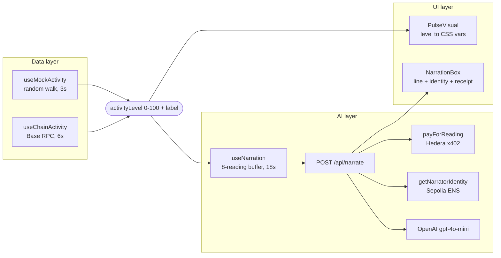
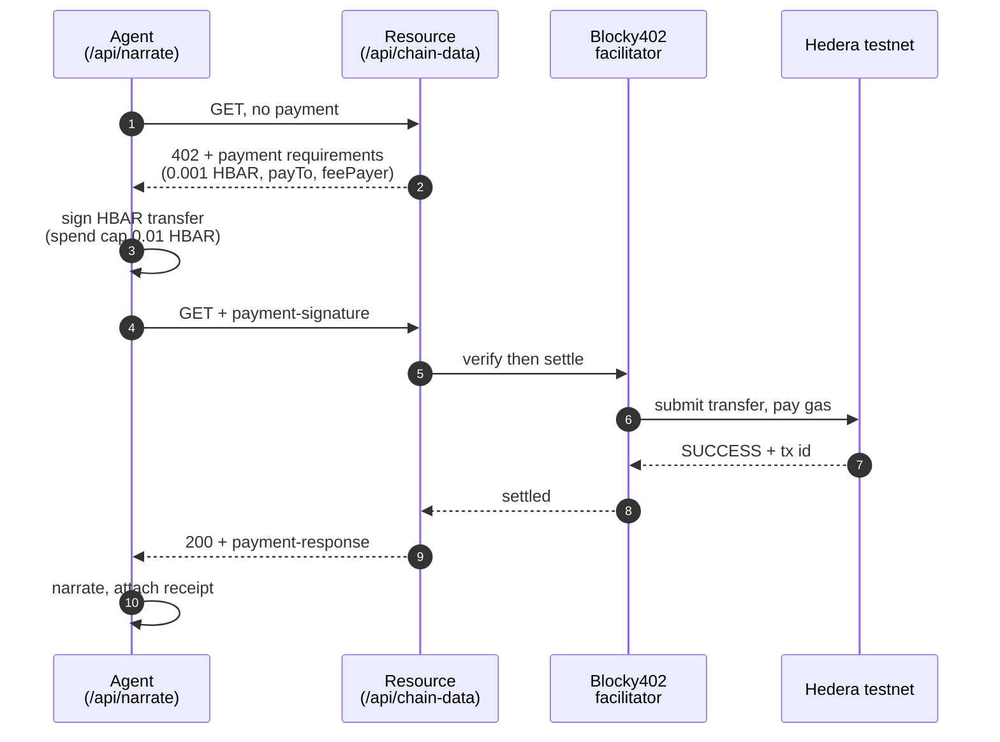

# Onchain Heartbeat

A live visual pulse of blockchain activity, narrated by an AI commentator that pays for its own data.

A circle beats in the middle of the screen. Its rhythm, amplitude and colour are driven by real gas usage on Base mainnet — calm cyan with a slow swell when the chain is quiet, fast crimson thumping when it is busy. Every 18 seconds an agent buys a metered reading over Hedera x402, then narrates what just happened in one line of play-by-play commentary.

Three things happen at once, and the UI shows all three: the chain's state, an agent paying for data, and that agent's onchain identity.

---

## Quick start

```bash
npm install
cp .env.example .env.local     # then fill in the keys below
npm run dev                    # http://localhost:3000
npm test                       # self-check on the 0-100 activity scale
```

The app runs with **no keys at all**. Without them the narrator stays silent, the metered resource is served free, and the identity renders unregistered — nothing crashes. Each key you add lights up one more layer.

| variable | layer | effect if unset |
|---|---|---|
| `OPENAI_API_KEY` | AI | panel holds its last line; pulse unaffected |
| `HEDERA_ACCOUNT_ID` / `HEDERA_PRIVATE_KEY` / `HEDERA_PAY_TO` | payments | resource served free, `unpaid` chip |
| `NARRATOR_ENS_NAME` | identity | defaults to `onchain-heartbeat.eth` |
| `SEPOLIA_RPC_URL` | identity | viem's public Sepolia RPC |
| `NEXT_PUBLIC_DATA_SOURCE` | data | live Base data; set to `mock` for a random walk |
| `NEXT_PUBLIC_RPC_URL` | data | `https://mainnet.base.org` |
| `X402_FACILITATOR_URL` / `X402_FEE_PAYER` | payments | Blocky402 testnet defaults |

---

## Architecture

Three layers with one seam between each. The rule the codebase enforces is that **the visual never knows where its number came from**.



The seam is `reading`: everything left of it can be swapped without touching
anything right of it.

**Data layer.** `hooks/useChainActivity.ts` polls one Base block header every 6s and normalises `gasUsed` onto 0-100. Thresholds in `hooks/activity.ts` came from sampling 50 consecutive blocks — p10 18.9M, p50 26.5M, p90 41.2M gas — so 12M-45M spans quiet to busy. `useMockActivity` returns the identical shape, which is the whole point: either can drive the page and `PulseVisual.tsx` never changes.

**AI layer.** `app/api/narrate/route.ts` takes a reading plus the recent window, computes the delta in points and percent, and asks for one line of commentary. The prompt bans invented specifics (token names, dollar amounts, wallet counts) because none of that is in the payload. A rotating opening directive is appended per call — without it the model converges on a single sentence template within a few narrations.

**UI layer.** `PulseVisual` maps 0-100 onto three CSS custom properties (`--beat`, `--amp`, `--hue`) and lets CSS keyframes do the animating, so the heartbeat runs on the compositor rather than in JS. `@property` registrations let amplitude and hue ease between readings instead of snapping.

---

## Hedera x402 payments

`/api/chain-data` is a real metered resource guarded by `@x402/next`. Before each narration the agent buys it: the GET returns `402` with payment requirements, the agent signs an HBAR transfer, **Blocky402** settles it on Hedera testnet, and the retry returns the data. 0.001 HBAR per narration, charged **per call, never batched**. Batching would amortise the round trips, but it also breaks the thing x402 is for: one request, one payment, one receipt. Per-call keeps every narration individually auditable, and an 18s cadence leaves ample room for the two round trips.



Settlement goes through Blocky402 (BlockyDevs), as the agentic-payments track requires. It is a different operator from Coinbase's x402.org facilitator — same protocol, different host, and a different fee payer account:

```
https://api.testnet.blocky402.com    hedera:testnet, fee payer 0.0.7162784
https://api.blocky402.com            hedera:mainnet, fee payer 0.0.10571514
```

### Buy a reading yourself

The endpoint is a real x402 resource, not a private arrangement between the app
and itself — anyone with a funded Hedera testnet account can pay for one:

```bash
HEDERA_ACCOUNT_ID=0.0.xxxxx HEDERA_PRIVATE_KEY=0x... node scripts/buy-reading.mjs
```

```
402 Payment Required
  price      0.001 HBAR (100000 tinybars)
  payTo      0.0.7117761
  feePayer   0.0.7162784

settled
  payer      0.0.7055006
  tx         0.0.7162784@1789026732.639649485

reading
{ "licensed": true, "issuedAt": "...", "source": "Base mainnet gas usage, ..." }
```

A plain `curl` cannot do this: x402 needs a signed payment, so the header has to
come from a client holding a key. `URL=` points the script at a deployment.

### Verified settlement

```
tx  0.0.7162784@1788690223.769989855
    https://hashscan.io/testnet/transaction/0.0.7162784%401788690223.769989855
```

Confirmed against the Hedera mirror node — `SUCCESS`, `CRYPTOTRANSFER`:

```
0.0.7055006   -100000 tinybars   the agent
0.0.7117761   +100000 tinybars   the data provider
0.0.7162784   -246808 tinybars   Blocky402 - submitted the tx and paid all gas
0.0.802       +246808 tinybars   network fee
```

The submitting account is Blocky402's, so the settlement path is checkable on-chain rather than taken on trust. The fee-payer model means the agent spends only its 0.001 HBAR; gas is the facilitator's.

The client sets a hard `maxAmountPerPayment` of 0.01 HBAR. An agent paying on a timer should have a ceiling.

---

## ENS identity

The narrator has an onchain name, resolved against the **ETHOnline 2026 ENSv2 deployment** on Sepolia rather than the mainnet-lineage registry.

### Implemented and independently verified

The Universal Resolver address viem ships for Sepolia is overridden with the hackathon `UpgradableUniversalResolverProxy`:

```ts
ensUniversalResolver: { address: "0xd26f2040d083af1cd2962ba303f4bea0c4faf142" }
```

This is a genuinely separate namespace, not another view of the same registry: `nick.eth` has a resolver record under viem's default address and `0x0` under the hackathon one. The resolution table below shows the inversion.

That also means an earlier "resolver path proven via nick.eth" check was **invalid** under this deployment and has been retracted. A name must be registered in the hackathon registry to resolve here; registering through app.ens.domains does nothing for it.

### Registered and resolving

`onchain-heartbeat.eth` is registered on the hackathon deployment and resolves
to the narrator's wallet, so the UI shows it as verified.

| name | viem default UR | hackathon UR |
|---|---|---|
| `onchain-heartbeat.eth` | `(null)` | `0xf866683E...97d4` |
| `nick.eth` | `0xb8c2C29e...67d5` | `(null)` |
| `vitalik.eth` | `0xd8dA6BF2...6045` | `(null)` |

Our name resolves only through the hackathon resolver and the mainnet-lineage
names only through viem's default one. That inversion is the proof it is
genuinely the hackathon deployment answering, not a fallback.

The name carries a profile, not just an address — the narrator card in the UI
is rendered from these records, so what you see is what the chain says about
this agent:

| record | value |
|---|---|
| `addr` | `0xf866683E...97d4` |
| `description` | A live pulse of Base mainnet activity. I buy each reading over Hedera x402, then call the play-by-play. |
| `avatar` | the repo's `app/icon.svg` |
| `url` | this repository |

Written with `scripts/set-ens-profile.mjs`. That means any consumer of a
narration can resolve which agent produced it and look up who that agent is.

Registration had to bypass the hackathon's ENS app, which cannot complete it
(see `docs/ens-app-bug-report.md`). `scripts/register-ens.mjs` and
`scripts/deploy-resolver.mjs` go straight at the contracts:

```
approve      0x734b3e27ef7ecef7a0b78453bc441517f740a894e766ec7cb43e5fdd9132b643
commit       0x5123a12b679ee508c850da8910e482a247194712ab7ecc589b4bfb4feeb106cb
register     0xc8c7ff64f370aaa0c98a8e8c94ea74b7ae0eabc06a373f694ba20b3ea2ded649
deployProxy  0xf1b8e5874570b0b3bbae9a90a18798a8f545e6fe94748d766fc55d9b6284fadf
setResolver  0x07b66176b03c404fcfa4f67198d137a486cca7d9cbf5624fee571b10373252f6
setAddress   0xfebbdb5ef2c7386eb803fa17e570ea4402cf103153f1c5d06062d8f8b312c827
setText×3    0x157c1bbbbf7ebfc9a37bcfa8c21a3cdf2f8cbe30e27d933dfd9b89442538f7cd
             0xc088c38c153cdd691c9840c50ce4db166c3dbb592a3e6ea6b81f64603c50bcc2
             0x286b23fa8ce281c3d4d13d779a16a64375309058ba92fea4e23ab963d3716dd6
```

Two things about ENSv2 that are easy to get wrong, both found the hard way:

**Registration is commit-reveal and paid in ERC-20, not ETH.** `commit`, wait
`MIN_COMMITMENT_AGE` (60s), then `register`. The fee is 8.000021 of the
deployment's own test USDC (`0xcBFD80F7...6F05`) per year, pulled by the
registrar, so it needs an `approve` first. The register transaction sends zero
native ETH.

**Records live on a per-name Permissioned Resolver proxy, keyed by DNS-encoded
names.** Registering against the shared `PublicResolverV2` leaves you unable to
write records - `canModifyName` returns false for every node derivation,
because the resolver is addressed by `setAddress(bytes name, uint256 coinType,
bytes value)`, not by namehash. Each name needs its own proxy, deployed through
the factory with `initialize((address,uint256)[],bytes[])`.

Every step is simulated before it is sent, and all three of the resolver steps
are additionally checked together via `eth_simulateV1` against one projected
post-state - which is the only way to verify `setAddress` against a proxy that
does not exist yet.

---

## Behaviour under failure

Every external dependency degrades instead of breaking. Verified by running the app against dead endpoints:

| broken thing | what happens |
|---|---|
| Base RPC unreachable | pulse holds its last rate, logs `[chain]`, keeps beating |
| Blocky402 unreachable | `payment.paid: false`, narration still delivered |
| Sepolia RPC unreachable | identity renders unregistered, everything else fine |
| OpenAI key invalid | `502`, panel keeps its previous line |
| malformed request body | `400 Bad payload` |
| garbage `X-PAYMENT` header | `402`, not a crash |

Non-numeric entries in `recentValues` are filtered rather than rejected.

---

## Layout

```
app/
  page.tsx                 composition root, picks the data source
  api/narrate/route.ts     validate -> pay -> identity -> narrate
  api/chain-data/route.ts  the x402-metered resource
components/
  PulseVisual.tsx          0-100 -> CSS custom properties
  NarrationBox.tsx         narration, identity, payment receipt
hooks/
  activity.ts              easing, labels, gas normalisation (+ tests)
  useChainActivity.ts      live Base data
  useMockActivity.ts       random walk, same shape
  useNarration.ts          rolling buffer, 18s cadence
lib/
  x402.ts                  the paying client
  ens.ts                   identity resolution
scripts/
  register-ens.mjs         commit-reveal registration, direct to contracts
  deploy-resolver.mjs      per-name resolver proxy + address record
  set-ens-profile.mjs      avatar / description / url text records
  buy-reading.mjs          pay for one reading as a third party
  send-raw-tx.mjs          manual tx sender with simulation
```
