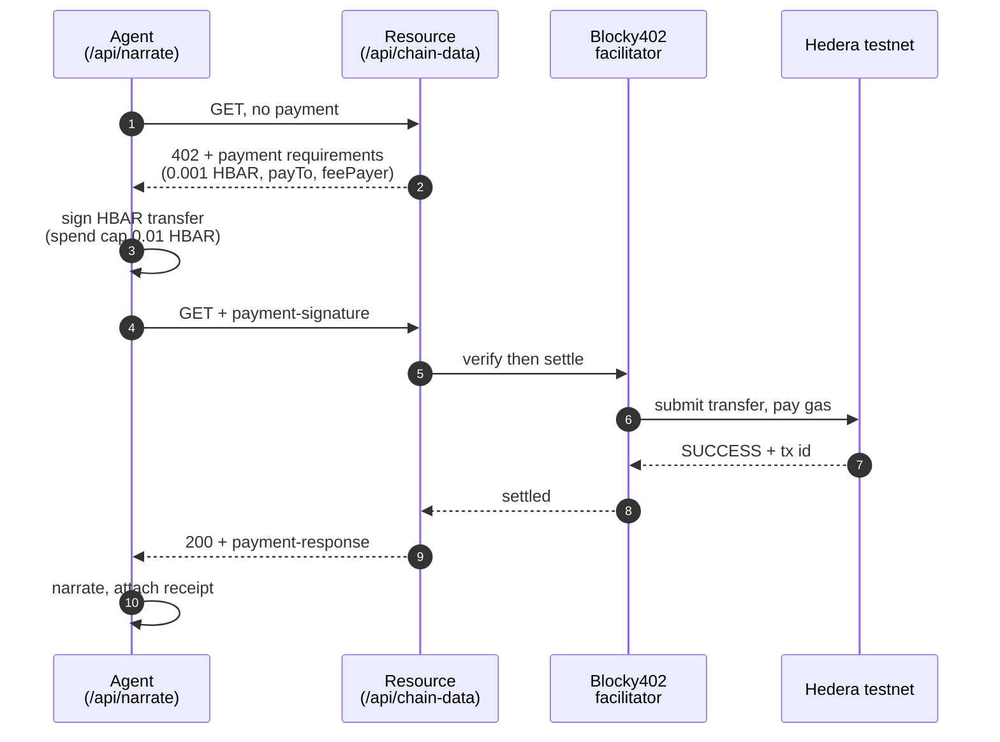

# Onchain Heartbeat

A live visual pulse of blockchain activity, narrated by an AI commentator that pays for its own data.

A circle beats in the middle of the screen. Its rhythm, amplitude and colour are driven by live Uniswap v3 swap flow on Base, read from a subgraph through The Graph — calm cyan with a slow swell when the chain is quiet, fast crimson thumping when it is busy. Every 18 seconds an agent buys a metered reading over Hedera x402, then narrates what just happened in one line of play-by-play commentary.

Three things happen at once, and the UI shows all three: the chain's state, an agent paying for data, and that agent's onchain identity.

---

## Quick start

```bash
npm install
cp .env.example .env.local     # then fill in the keys below
npm run dev                    # http://localhost:3000
npm test                       # self-check on the 0-100 activity scale
```

The app runs with **no keys at all**. Without them the narrator stays silent, the metered resource is served free, and the identity renders unregistered — nothing crashes. Each key you add lights up one more layer.

| variable | layer | effect if unset |
|---|---|---|
| `OPENAI_API_KEY` | AI | panel holds its last line; pulse unaffected |
| `HEDERA_ACCOUNT_ID` / `HEDERA_PRIVATE_KEY` / `HEDERA_PAY_TO` | payments | resource served free, `unpaid` chip |
| `NARRATOR_ENS_NAME` | identity | defaults to `onchain-heartbeat.eth` |
| `SEPOLIA_RPC_URL` | identity | viem's public Sepolia RPC |
| `GRAPH_API_KEY` | data | pulse falls back to `/api/activity` 503; set `NEXT_PUBLIC_DATA_SOURCE=rpc` |
| `NEXT_PUBLIC_DATA_SOURCE` | data | `graph` (default), `rpc`, or `mock` |
| `NEXT_PUBLIC_RPC_URL` | data | `https://mainnet.base.org` |
| `X402_FACILITATOR_URL` / `X402_FEE_PAYER` | payments | Blocky402 testnet defaults |

---

## Architecture

Three layers with one seam between each. The rule the codebase enforces is that **the visual never knows where its number came from**.


The seam is `reading`: everything left of it can be swapped without touching
anything right of it.

**Data layer — three interchangeable sources.** All return `{ activityLevel, label }`, so any of them can drive the page and `PulseVisual.tsx` never changes:

| source | what it reads | cadence |
|---|---|---|
| `useGraphActivity` (default) | Uniswap v3 swaps on Base, via a Messari standardized subgraph on The Graph | 15s |
| `useChainActivity` | `gasUsed` from one Base block header, public RPC | 6s |
| `useMockActivity` | a random walk, for demos when a feed is unavailable | 3s |

Thresholds in `hooks/activity.ts` are calibrated from sampled data, never guessed. Swap flow: 341 / 405 / 577 / 652 swaps-per-minute at p10 / p50 / p90 / max, so 150-600 spans quiet to busy — with the floor set below the sample minimum because flow was observed at 246/min shortly afterwards, and a two-minute sample understates the real range. Gas: p10 18.9M, p50 26.5M, p90 41.2M across 50 consecutive blocks, so 12M-45M.

**AI layer.** `app/api/narrate/route.ts` takes a reading plus the recent window, computes the delta in points and percent, and asks for one line of commentary. The prompt bans invented specifics (token names, dollar amounts, wallet counts) because none of that is in the payload. A rotating opening directive is appended per call — without it the model converges on a single sentence template within a few narrations.

**UI layer.** `PulseVisual` maps 0-100 onto three CSS custom properties (`--beat`, `--amp`, `--hue`) and lets CSS keyframes do the animating, so the heartbeat runs on the compositor rather than in JS. `@property` registrations let amplitude and hue ease between readings instead of snapping.

---

## The Graph

The pulse runs on indexed data, not raw RPC. `lib/graph.ts` queries a Messari
**standardized** subgraph for Uniswap v3 on Base through The Graph's gateway,
derives swaps-per-minute from the timestamp span of the last 500 swaps, and
normalises that onto the 0-100 scale.

```
[graph] 246 swaps/min ($57,912/min) -> level 11  block 51134930
```

Two details that matter:

**A wider window is not cosmetic.** With 100 swaps the span is a handful of
integer seconds, so the derived rate quantises into coarse jumps — 429, 600,
750, 1500. At 500 swaps the span is around a minute and the signal is smooth.

**The key never reaches the browser.** The client polls `/api/activity`, which
holds the key server-side. One query per 15s poll, against a free tier of
100,000 queries a month.

The metered resource the agent buys is the same reading, so the payment
actually purchases indexed data rather than a receipt — which is what ties this
to the payment layer below.

---

## Hedera x402 payments

`/api/chain-data` is a real metered resource guarded by `@x402/next`. Before each narration the agent buys it: the GET returns `402` with payment requirements, the agent signs an HBAR transfer, **Blocky402** settles it on Hedera testnet, and the retry returns the data. 0.001 HBAR per narration, charged **per call, never batched**. Batching would amortise the round trips, but it also breaks the thing x402 is for: one request, one payment, one receipt. Per-call keeps every narration individually auditable, and an 18s cadence leaves ample room for the two round trips.



Settlement goes through Blocky402 (BlockyDevs), as the agentic-payments track requires. It is a different operator from Coinbase's x402.org facilitator — same protocol, different host, and a different fee payer account:

```
https://api.testnet.blocky402.com    hedera:testnet, fee payer 0.0.7162784
https://api.blocky402.com            hedera:mainnet, fee payer 0.0.10571514
```

### Buy a reading yourself

The endpoint is a real x402 resource, not a private arrangement between the app
and itself — anyone with a funded Hedera testnet account can pay for one:

```bash
HEDERA_ACCOUNT_ID=0.0.xxxxx HEDERA_PRIVATE_KEY=0x... node scripts/buy-reading.mjs
```

```
402 Payment Required
  price      0.001 HBAR (100000 tinybars)
  payTo      0.0.7117761
  feePayer   0.0.7162784

settled
  payer      0.0.7055006
  tx         0.0.7162784@1789026732.639649485

reading
{ "licensed": true, "issuedAt": "...", "source": "Base mainnet gas usage, ..." }
```

A plain `curl` cannot do this: x402 needs a signed payment, so the header has to
come from a client holding a key. `URL=` points the script at a deployment.

### Verified settlement

```
tx  0.0.7162784@1788690223.769989855
    https://hashscan.io/testnet/transaction/0.0.7162784%401788690223.769989855
```

Confirmed against the Hedera mirror node — `SUCCESS`, `CRYPTOTRANSFER`:

```
0.0.7055006   -100000 tinybars   the agent
0.0.7117761   +100000 tinybars   the data provider
0.0.7162784   -246808 tinybars   Blocky402 - submitted the tx and paid all gas
0.0.802       +246808 tinybars   network fee
```

The submitting account is Blocky402's, so the settlement path is checkable on-chain rather than taken on trust. The fee-payer model means the agent spends only its 0.001 HBAR; gas is the facilitator's.

The client sets a hard `maxAmountPerPayment` of 0.01 HBAR. An agent paying on a timer should have a ceiling.

---

## ENS identity

The narrator owns `onchain-heartbeat.eth` on the **dedicated ETHOnline 2026
hackathon deployment** (the ENS docs' "Sepolia (ENSv2 Beta)" table), and the
name carries a profile rather than just an address:

| record | value |
|---|---|
| `addr` | `0xf866683E...97d4` |
| `description` | A live pulse of Base mainnet activity. I buy each reading over Hedera x402, then call the play-by-play. |
| `avatar` | the repo's `app/icon.svg` |
| `url` | this repository |

viem ships mainnet-lineage Universal Resolver addresses for Sepolia, so the
deployment's own is used instead:

```ts
ensUniversalResolver: { address: "0xd26f2040d083af1cd2962ba303f4bea0c4faf142" }
```

Resolution through that resolver, at one block:

| name | viem default UR | hackathon UR |
|---|---|---|
| `onchain-heartbeat.eth` | `(null)` | `0xf866683E...97d4` |
| `nick.eth` | `0xb8c2C29e...67d5` | `(null)` |
| `vitalik.eth` | `0xd8dA6BF2...6045` | `(null)` |

Our name resolves only through the hackathon resolver and the mainnet-lineage
names only through viem's default one. That inversion is the proof it is
genuinely the hackathon deployment answering, not a fallback.

### Every notable call gets its own name

When the mood changes, the narrator publishes that call as a subname:

```
a-drastic-drop-31.posts.onchain-heartbeat.eth
  description  A drastic drop of 56% as activity dives...
  activity     31
  payment      0.0.7162784@1789051592.080380617
```

Resolve any post name and you get the comment, the reading behind it, and the
Hedera transaction that paid for it — so a claim can be traced back to the
agent that made it and the data it bought.

**No subname registration is involved.** The name's Permissioned Resolver keys
records by DNS-encoded name rather than by node, and the Universal Resolver
reaches it by ENSIP-10 wildcard, so writing records is enough to make a subname
resolve. One `multicall` per post, no CCIP-Read gateway.

Publishing is on a change of label, not every beat — at an 18s cadence that
would be ~200 transactions an hour and a feed nobody reads. This way the
subnames are the narrator's highlight reel.

### Registering without the portal

The hackathon portal could not complete a registration when this was built, so
`scripts/register-ens.mjs` and `scripts/deploy-resolver.mjs` go straight at the
contracts:

```
approve      0x734b3e27ef7ecef7a0b78453bc441517f740a894e766ec7cb43e5fdd9132b643
commit       0x5123a12b679ee508c850da8910e482a247194712ab7ecc589b4bfb4feeb106cb
register     0xc8c7ff64f370aaa0c98a8e8c94ea74b7ae0eabc06a373f694ba20b3ea2ded649
deployProxy  0xf1b8e5874570b0b3bbae9a90a18798a8f545e6fe94748d766fc55d9b6284fadf
setResolver  0x07b66176b03c404fcfa4f67198d137a486cca7d9cbf5624fee571b10373252f6
setAddress   0xfebbdb5ef2c7386eb803fa17e570ea4402cf103153f1c5d06062d8f8b312c827
setText x3   0x157c1bbb… 0xc088c38c… 0x286b23fa…
```

`docs/ens-app-bug-report.md` documents the defect: the app encoded
`initialize`'s first argument as `address,uint256` where the implementation
expects `(address,uint256)[]`, producing a selector that matched no function.

Three things about ENSv2 worth knowing, all found the hard way:

**Registration is commit-reveal and paid in ERC-20, not ETH.** `commit`, wait
`MIN_COMMITMENT_AGE` (60s), then `register`, with an `approve` first because the
registrar pulls the fee — 8.000021 MockUSDC per year. The register transaction
sends zero native ETH.

**Records live on a per-name resolver, not a shared one.** Registering against
the shared `PublicResolverV2` leaves you unable to write records:
`canModifyName` returns false for every node derivation.

**There is more than one hackathon deployment in the wild.** The portal app
resolves against an undocumented set (`ETHRegistrar 0xa88553f4…`,
`registry 0xbdc85dd5…`) whose resolver keys records by namehash rather than by
DNS-encoded name. The name is set up on that one too, but this app targets the
documented deployment. `ENS_UNIVERSAL_RESOLVER` and `NARRATOR_RESOLVER` switch
it if that changes.

Every write is simulated before it is sent, and multi-step flows are checked
together with `eth_simulateV1` against one projected post-state.

---

## Behaviour under failure

Every external dependency degrades instead of breaking. Verified by running the app against dead endpoints:

| broken thing | what happens |
|---|---|
| The Graph unreachable | pulse holds its last rate, logs `[graph]`, keeps beating |
| Base RPC unreachable | same, on the `rpc` source |
| Blocky402 unreachable | `payment.paid: false`, narration still delivered |
| Sepolia RPC unreachable | identity renders unregistered, everything else fine |
| OpenAI key invalid | `502`, panel keeps its previous line |
| malformed request body | `400 Bad payload` |
| garbage `X-PAYMENT` header | `402`, not a crash |

Non-numeric entries in `recentValues` are filtered rather than rejected.

---

## Layout

```
app/
  page.tsx                 composition root, picks the data source
  api/narrate/route.ts     validate -> pay -> identity -> narrate
  api/activity/route.ts    the subgraph reading the pulse runs on
  api/chain-data/route.ts  the x402-metered resource, same reading
components/
  PulseVisual.tsx          0-100 -> CSS custom properties
  NarrationBox.tsx         narration, identity, payment receipt
hooks/
  activity.ts              easing, labels, both normalisations (+ tests)
  useGraphActivity.ts      Uniswap swap flow via The Graph
  useChainActivity.ts      Base gas usage via public RPC
  useMockActivity.ts       random walk, same shape
  useNarration.ts          rolling buffer, 18s cadence
lib/
  graph.ts                 the subgraph query and normalisation
  x402.ts                  the paying client
  ens.ts                   identity resolution
scripts/
  sample-graph.mjs         probe candidate subgraphs and schemas
  calibrate-graph.mjs      sample repeatedly to set thresholds
  register-ens.mjs         commit-reveal registration, direct to contracts
  deploy-resolver.mjs      per-name resolver proxy + address record
  set-ens-profile.mjs      avatar / description / url text records
  buy-reading.mjs          pay for one reading as a third party
  send-raw-tx.mjs          manual tx sender with simulation
```
