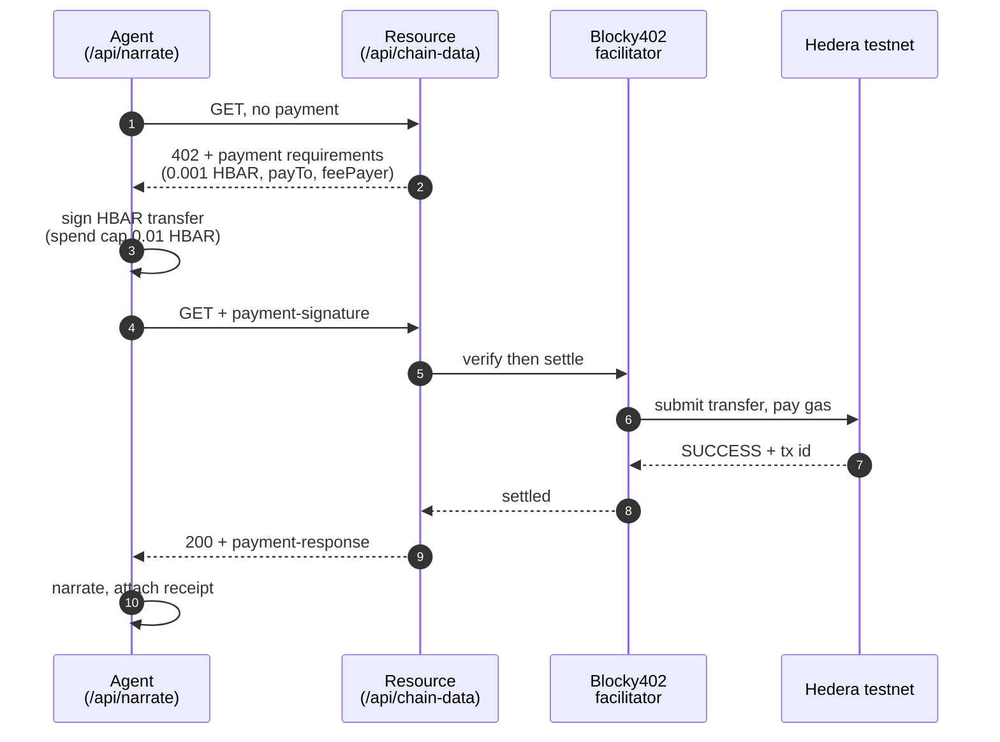

# Onchain Heartbeat

A live visual pulse of blockchain activity, narrated by an AI commentator that pays for its own data.

A circle beats in the middle of the screen. Its rhythm, amplitude and colour are driven by real gas usage on Base mainnet — calm cyan with a slow swell when the chain is quiet, fast crimson thumping when it is busy. Every 18 seconds an agent buys a metered reading over Hedera x402, then narrates what just happened in one line of play-by-play commentary.

Three things happen at once, and the UI shows all three: the chain's state, an agent paying for data, and that agent's onchain identity.

---

## Quick start

```bash
npm install
cp .env.example .env.local     # then fill in the keys below
npm run dev                    # http://localhost:3000
npm test                       # self-check on the 0-100 activity scale
```

The app runs with **no keys at all**. Without them the narrator stays silent, the metered resource is served free, and the identity renders unregistered — nothing crashes. Each key you add lights up one more layer.

| variable | layer | effect if unset |
|---|---|---|
| `OPENAI_API_KEY` | AI | panel holds its last line; pulse unaffected |
| `HEDERA_ACCOUNT_ID` / `HEDERA_PRIVATE_KEY` / `HEDERA_PAY_TO` | payments | resource served free, `unpaid` chip |
| `NARRATOR_ENS_NAME` | identity | defaults to `onchain-heartbeat.eth` |
| `SEPOLIA_RPC_URL` | identity | viem's public Sepolia RPC |
| `NEXT_PUBLIC_DATA_SOURCE` | data | live Base data; set to `mock` for a random walk |
| `NEXT_PUBLIC_RPC_URL` | data | `https://mainnet.base.org` |
| `X402_FACILITATOR_URL` / `X402_FEE_PAYER` | payments | Blocky402 testnet defaults |

---

## Architecture

Three layers with one seam between each. The rule the codebase enforces is that **the visual never knows where its number came from**.


The seam is `reading`: everything left of it can be swapped without touching
anything right of it.

**Data layer.** `hooks/useChainActivity.ts` polls one Base block header every 6s and normalises `gasUsed` onto 0-100. Thresholds in `hooks/activity.ts` came from sampling 50 consecutive blocks — p10 18.9M, p50 26.5M, p90 41.2M gas — so 12M-45M spans quiet to busy. `useMockActivity` returns the identical shape, which is the whole point: either can drive the page and `PulseVisual.tsx` never changes.

**AI layer.** `app/api/narrate/route.ts` takes a reading plus the recent window, computes the delta in points and percent, and asks for one line of commentary. The prompt bans invented specifics (token names, dollar amounts, wallet counts) because none of that is in the payload. A rotating opening directive is appended per call — without it the model converges on a single sentence template within a few narrations.

**UI layer.** `PulseVisual` maps 0-100 onto three CSS custom properties (`--beat`, `--amp`, `--hue`) and lets CSS keyframes do the animating, so the heartbeat runs on the compositor rather than in JS. `@property` registrations let amplitude and hue ease between readings instead of snapping.

---

## Hedera x402 payments

`/api/chain-data` is a real metered resource guarded by `@x402/next`. Before each narration the agent buys it: the GET returns `402` with payment requirements, the agent signs an HBAR transfer, **Blocky402** settles it on Hedera testnet, and the retry returns the data. 0.001 HBAR per narration, charged **per call, never batched**. Batching would amortise the round trips, but it also breaks the thing x402 is for: one request, one payment, one receipt. Per-call keeps every narration individually auditable, and an 18s cadence leaves ample room for the two round trips.



Settlement goes through Blocky402 (BlockyDevs), as the agentic-payments track requires. It is a different operator from Coinbase's x402.org facilitator — same protocol, different host, and a different fee payer account:

```
https://api.testnet.blocky402.com    hedera:testnet, fee payer 0.0.7162784
https://api.blocky402.com            hedera:mainnet, fee payer 0.0.10571514
```

### Buy a reading yourself

The endpoint is a real x402 resource, not a private arrangement between the app
and itself — anyone with a funded Hedera testnet account can pay for one:

```bash
HEDERA_ACCOUNT_ID=0.0.xxxxx HEDERA_PRIVATE_KEY=0x... node scripts/buy-reading.mjs
```

```
402 Payment Required
  price      0.001 HBAR (100000 tinybars)
  payTo      0.0.7117761
  feePayer   0.0.7162784

settled
  payer      0.0.7055006
  tx         0.0.7162784@1789026732.639649485

reading
{ "licensed": true, "issuedAt": "...", "source": "Base mainnet gas usage, ..." }
```

A plain `curl` cannot do this: x402 needs a signed payment, so the header has to
come from a client holding a key. `URL=` points the script at a deployment.

### Verified settlement

```
tx  0.0.7162784@1788690223.769989855
    https://hashscan.io/testnet/transaction/0.0.7162784%401788690223.769989855
```

Confirmed against the Hedera mirror node — `SUCCESS`, `CRYPTOTRANSFER`:

```
0.0.7055006   -100000 tinybars   the agent
0.0.7117761   +100000 tinybars   the data provider
0.0.7162784   -246808 tinybars   Blocky402 - submitted the tx and paid all gas
0.0.802       +246808 tinybars   network fee
```

The submitting account is Blocky402's, so the settlement path is checkable on-chain rather than taken on trust. The fee-payer model means the agent spends only its 0.001 HBAR; gas is the facilitator's.

The client sets a hard `maxAmountPerPayment` of 0.01 HBAR. An agent paying on a timer should have a ceiling.

---

## ENS identity

The narrator owns `onchain-heartbeat.eth` on the **ETHOnline 2026 ENSv2
deployment** (Sepolia), and the name carries a profile rather than just an
address:

| record | value |
|---|---|
| `addr` | `0xf866683E...97d4` |
| `description` | A live pulse of Base mainnet activity. I buy each reading over Hedera x402, then call the play-by-play. |
| `avatar` | the repo's `app/icon.svg` |
| `url` | this repository |

```
registry   0xbdc85dd5b15d7ecb354cd7cb6f2c50b4f2c4f0e2
resolver   0x7745211F67E01b7902f3B44bc4ADAa59CfBeA8dB   (provisioned at registration)
```

Records are read straight from the registry and the name's resolver rather than
through a Universal Resolver. The deployment gives every name its own resolver
at registration, so `getResolver` already points at the right contract, and
this keeps working when the Universal Resolver address changes.

### Every notable call gets its own name

When the mood changes, the narrator publishes that call as a subname:

```
traders-are-surging-77.posts.onchain-heartbeat.eth
  description  Traders are surging in, activity climbing 71%...
  activity     77
  payment      0.0.7162784@1789048783.400117670
```

Resolve any post name and you get the comment, the reading behind it, and the
Hedera transaction that paid for it — so a claim can be traced back to the
agent that made it and the data it bought.

**No subname registration is involved.** Records live on the narrator's own
resolver keyed by namehash, so writing them is what makes the name addressable.
One transaction per post, no CCIP-Read gateway.

Publishing is on a change of label, not every beat — at an 18s cadence that
would be ~200 transactions an hour and a feed nobody reads. This way the
subnames are the narrator's highlight reel.

### Registering without the portal

The hackathon portal could not complete a registration when this was built, so
`scripts/register-ens.mjs` goes straight at the contracts — commit-reveal,
ERC-20 fee, then records. The portal has since been fixed and now provisions a
resolver itself, which is the path in use.

`docs/ens-app-bug-report.md` documents the original defect: the app encoded
`initialize`'s first argument as `address,uint256` where the implementation
expects `(address,uint256)[]`, producing a selector that matched no function.

Two things about ENSv2 worth knowing, both found the hard way:

**Registration is commit-reveal and paid in ERC-20, not ETH.** `commit`, wait
`MIN_COMMITMENT_AGE` (60s), then `register`, with an `approve` first because the
registrar pulls the fee. The register transaction sends zero native ETH.

**Resolver interfaces differ between deployments.** One keys records by
DNS-encoded name (`setText(bytes,string,string)`), the other by namehash
(`setText(bytes32,string,string)`). Reading `getResolver` and matching its
interface is the portable approach; assuming either one is not.

Every write is simulated before it is sent, and multi-step flows are checked
together with `eth_simulateV1` against one projected post-state.

---

## Behaviour under failure

Every external dependency degrades instead of breaking. Verified by running the app against dead endpoints:

| broken thing | what happens |
|---|---|
| Base RPC unreachable | pulse holds its last rate, logs `[chain]`, keeps beating |
| Blocky402 unreachable | `payment.paid: false`, narration still delivered |
| Sepolia RPC unreachable | identity renders unregistered, everything else fine |
| OpenAI key invalid | `502`, panel keeps its previous line |
| malformed request body | `400 Bad payload` |
| garbage `X-PAYMENT` header | `402`, not a crash |

Non-numeric entries in `recentValues` are filtered rather than rejected.

---

## Layout

```
app/
  page.tsx                 composition root, picks the data source
  api/narrate/route.ts     validate -> pay -> identity -> narrate
  api/chain-data/route.ts  the x402-metered resource
components/
  PulseVisual.tsx          0-100 -> CSS custom properties
  NarrationBox.tsx         narration, identity, payment receipt
hooks/
  activity.ts              easing, labels, gas normalisation (+ tests)
  useChainActivity.ts      live Base data
  useMockActivity.ts       random walk, same shape
  useNarration.ts          rolling buffer, 18s cadence
lib/
  x402.ts                  the paying client
  ens.ts                   identity resolution
scripts/
  register-ens.mjs         commit-reveal registration, direct to contracts
  deploy-resolver.mjs      per-name resolver proxy + address record
  set-ens-profile.mjs      avatar / description / url text records
  buy-reading.mjs          pay for one reading as a third party
  send-raw-tx.mjs          manual tx sender with simulation
```
