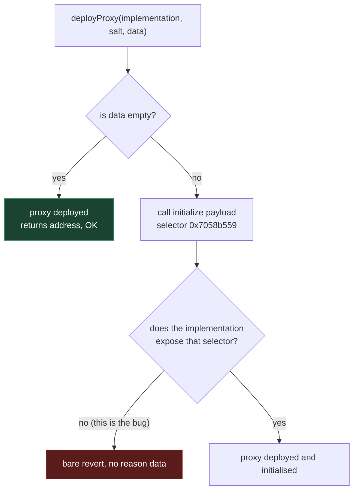

# Registration fails: `deployProxy` reverts on a malformed `initialize` payload (plus a 21M gas hardcode)

**App:** `hackathon-deployment-manager-app-v4.ens-cf.workers.dev`
**Network:** Sepolia (11155111)
**Impact:** name registration cannot complete — the transaction is rejected before sending, and would revert if sent.

## Summary

Registering a name produces a transaction that cannot succeed. There are **two independent problems**, and fixing only the visible one is not enough:

1. **The transaction reverts** because the inner `initialize(...)` payload calls a selector the implementation does not expose. This is the actual blocker.
2. **The app hardcodes `gas: 21_000_000`**, which public RPC providers reject outright. This is the error a user actually sees.

Fixing (2) alone converts a rejected transaction into a mined-and-reverted one — gas spent, still no name.

## The transaction

```
to:    0x894bc9cC8ff1ad96B8a288C86A8C71D662C07780   (factory)
value: 0
data:  0x5d84121a...   deployProxy(address,uint256,bytes)
```

Decoded:

| arg | value |
|---|---|
| implementation | `0xa9d3814ab151bf6e37a427432795371a8361614e` |
| salt | `0x9ffafaeefd36ff83cce2e982a6fe08ae0c13068aaeae58cd61a5d588e5603147` |
| data | `initialize(0xad1c4453df163396d2b4a2173212fc73c537652d, 0x1111…1111, [])` — selector `0x7058b559` |

## Evidence

Four variants of the same call, simulated with `eth_call`. **No private key and no funded wallet are needed** — this reproduces from `0x…dEaD`:

| variant | result |
|---|---|
| original salt + original init payload | **REVERT** |
| original salt + **empty** init payload | OK — returns a proxy address |
| new salt + original init payload | **REVERT** |
| new salt + **empty** init payload | OK — returns a proxy address |



The deployment succeeds with either salt and fails **only when the init payload is attached**. That rules out:

- a CREATE2 salt collision (a fresh random salt reverts identically)
- the caller's wallet, balance or nonce (reproduces from an address with no ETH and no history)
- the gas limit (`eth_call` does not enforce one)

The revert carries no data — a bare `revert()`, no reason string and no custom error selector.

## Root cause

**The app calls the wrong initializer.** The implementation at `0xa9d3814a…614e` exposes:

```
0x33cc44a0  initialize((address,uint256)[],bytes[])   <- what it has
0x7058b559  initialize(address,uint256,bytes[])       <- what the app calls
```

The first parameter is an **array of (address, roleBitmap) tuples**. The app flattens it into a bare `address, uint256` pair, which changes the selector, so the call matches no function and reverts.

A `deployProxy` that succeeded on this same factory (tx `0x0654b313dca0f7adcc7b65bb7d8821195a219d1b563be85e410f1b7dda6ddf1b`) sends:

```
0x33cc44a0
  [(0x9780aFE8…dd0B, 0x1111…1111)]   one (grantee, roles) tuple
  []                                  no extra setter calls
```

Note `0x1111…1111` is a **role bitmap, not a placeholder** — the same value appears in the working call. An earlier revision of this report speculated it was unfilled form state; that was wrong.

Scanning the 15,511-byte implementation for `0x7058b559` and six other common initialize shapes confirms the app's selector is absent:

```
  -      initialize(address,uint256,bytes[])   <- what the app calls
  -      initialize(address)
  -      initialize(address,address)
  -      initialize()
  -      initialize(address,uint256)
  -      initialize(address,bytes[])
  -      initialize(address,address,uint256)
PRESENT  multicall(bytes[])
```

None of them are present, only `0x33cc44a0`.

The fix is to ABI-encode the first argument as `(address,uint256)[]` — a one-element array containing the `(owner, roleBitmap)` tuple — rather than as two flat parameters.

## Reproduction

Node 18+, `npm i viem`, then:

```js
import { createPublicClient, http, toFunctionSelector } from "viem";
import { sepolia } from "viem/chains";

const c = createPublicClient({ chain: sepolia, transport: http() });
const FACTORY = "0x894bc9cC8ff1ad96B8a288C86A8C71D662C07780";
const FROM = "0x000000000000000000000000000000000000dEaD"; // any address

const SEL  = "5d84121a";
const IMPL = "000000000000000000000000a9d3814ab151bf6e37a427432795371a8361614e";
const SALT = "9ffafaeefd36ff83cce2e982a6fe08ae0c13068aaeae58cd61a5d588e5603147";
const OFF  = "0000000000000000000000000000000000000000000000000000000000000060";
const LEN  = "0000000000000000000000000000000000000000000000000000000000000084";
const INIT = "7058b559000000000000000000000000ad1c4453df163396d2b4a2173212fc73c537652d11111111111111111111111111111111111111111111111111111111111111110000000000000000000000000000000000000000000000000000000000000060000000000000000000000000000000000000000000000000000000000000000000000000000000000000000000000000000000000000000000000000";
const EMPTY = "0".repeat(64);
const build = (salt, tail) => "0x" + SEL + IMPL + salt + OFF + tail;

for (const [label, data] of [
  ["original salt + init payload", build(SALT, LEN + INIT)],
  ["original salt + EMPTY init  ", build(SALT, EMPTY)],
  ["new salt      + init payload", build("de".repeat(32), LEN + INIT)],
  ["new salt      + EMPTY init  ", build("de".repeat(32), EMPTY)],
]) {
  try {
    const r = await c.call({ account: FROM, to: FACTORY, data });
    console.log(label, " OK    ", r.data);
  } catch {
    console.log(label, " REVERT");
  }
}

// the implementation exposes no initialize(address,uint256,bytes[])
const code = await c.getBytecode({ address: "0xa9d3814ab151bf6e37a427432795371a8361614e" });
console.log("has 0x7058b559:", code.includes(toFunctionSelector("initialize(address,uint256,bytes[])").slice(2)));
```

Expected output: rows 1 and 3 revert, rows 2 and 4 return a proxy address, and the final line prints `false`.

## Expected vs actual

**Expected:** registering a name deploys and initialises a proxy, after which the name resolves through the deployment's Universal Resolver.

**Actual:** the app builds a transaction that is rejected by the RPC for its gas limit, and would revert on-chain if that were fixed. The name is never registered and resolves to `null`.

## Suggested fixes

1. Encode the first `initialize` argument as `(address,uint256)[]`, giving selector `0x33cc44a0`, instead of flattening it to `address,uint256` (`0x7058b559`).
2. Drop the hardcoded `gas: 21_000_000` and use `eth_estimateGas` with a modest buffer.

Working reference: tx `0x0654b313dca0f7adcc7b65bb7d8821195a219d1b563be85e410f1b7dda6ddf1b` on the same factory.

## Caveats

The selector scan is a bytecode substring check, so an unusual dispatcher could in principle route `0x7058b559` without the literal bytes appearing. The conclusion does not rest on it: the empty-init-succeeds / with-init-reverts result across two different salts is decisive on its own.

The proxy address returned by the successful variants depends on the caller, so the factory appears to mix `msg.sender` into the salt derivation. Not a problem, just worth knowing when comparing outputs.
